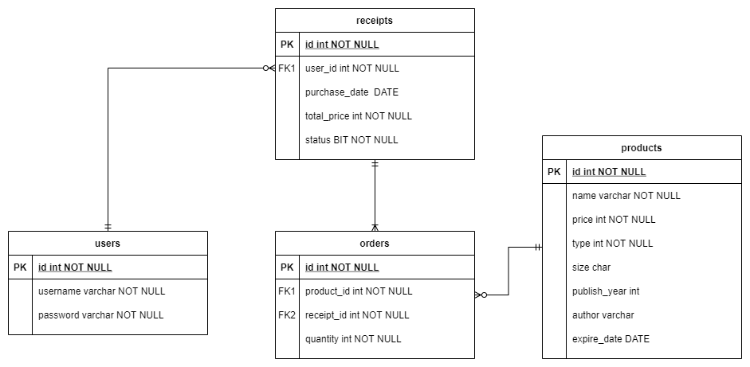

# About
Projek ini dibuat untuk menyelesaikan salah satu tugas matakuliah Object-Oriented Programming (OOP).
Projek ini dikerjakan secara kelompok berjumlah 4 orang.

Ayopa Shop diambil dari susunan huruf Yunani αγορά yang sebenarnya dibaca agorá yang berarti market dalam bahasa Inggris.

## :bangbang: UPDATE :bangbang:

Projek ini telah di update untuk penggunaan database pada implementasinya, serta terdapat beberapa penambahan Design Patterns seperti berikut,

Design Patterns
1. Singleton Design Pattern
Singleton adalah sebuah design pattern yang memastikan bahwa suatu class hanya memiliki satu instance.  Pada kasus kami, design pattern Singleton dapat ditemukan pada koneksi database, lebih tepatnya pada function getInstance(). Pada function ini terdapat if-condition di mana hanya jika class tersebut belum memiliki instance koneksi database, maka baru akan dibuat instance tersebut.
2. Factory Design Pattern
Factory adalah salah satu design pattern yang dapat dimanfaatkan dalam object-creating tanpa harus secara spesifik object dari class apa yang akan dibuat. Pada kasus kami, design pattern Factory dapat ditemukan pada pembuatan object Product dimana class Product memiliki inheritance dengan ClothingProduct, BookProduct, dan FoodProduct. Design pattern ini diimplementasikan dengan membuat class baru yaitu ProductFactory yang memiliki 3 buah function yang dapat digunakan untuk membuat object masing-masing class ClothingProduct, BookProduct, dan FoodProduct.

Dikarenakan projek ini telah menggunakan database dalam implementasinya, berikut adalah Entity Relationship Diagram yang menggambarkan arsitektur database projek ini,

## 

Ayopa Shop merupakan online convenience store yang menjual barang terbatas karena hanya ada tiga jenis barang yang dijual.
Tiga jenis barang tersebut antara lain,
1. Produk pakaian
2. Produk buku
3. Produk makanan

## Class Diagram

